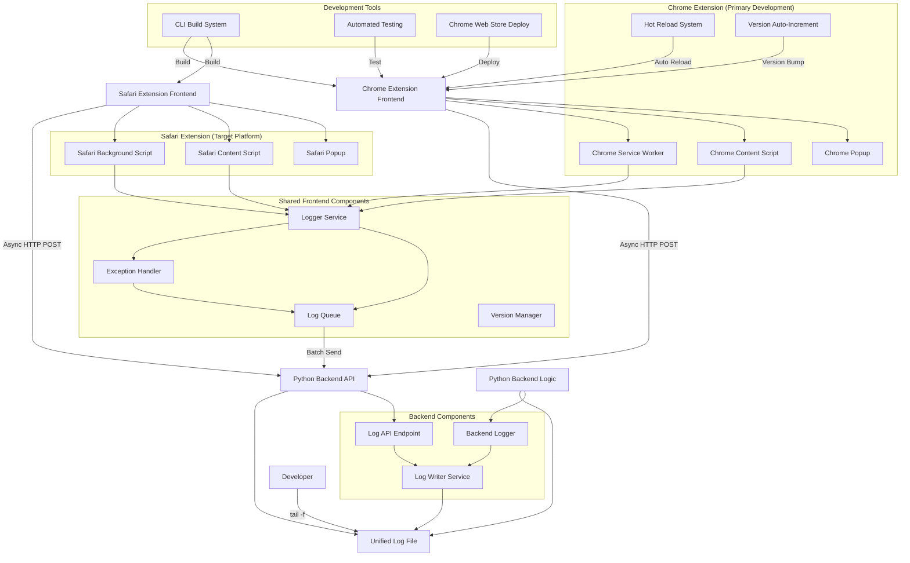

# Design Document

## Overview

The unified logging system consists of browser extension frontends (Chrome and Safari) built with ViteJS that communicate asynchronously with a Python backend to centralize all logging into a single file. The system uses HTTP-based communication for log transmission and implements a structured logging format that combines frontend and backend events with proper source identification and timestamps.

The Chrome extension serves as the primary development and validation platform due to its superior command-line development workflow, while the Safari extension provides the target deployment platform.

## Architecture



## Components and Interfaces

### Shared Frontend Components

#### Logger Service
- **Purpose**: Centralized logging interface for both Chrome and Safari extensions
- **Interface**: 
  ```typescript
  interface LoggerService {
    debug(message: string, context?: object): void;
    info(message: string, context?: object): void;
    warn(message: string, context?: object): void;
    error(message: string, context?: object): void;
  }
  ```
- **Responsibilities**: Format log entries, add metadata, queue for transmission

#### Exception Handler
- **Purpose**: Capture unhandled exceptions and errors
- **Interface**:
  ```typescript
  interface ExceptionHandler {
    captureException(error: Error, context?: object): void;
    setupGlobalHandlers(): void;
  }
  ```
- **Responsibilities**: Catch unhandled exceptions, format error details, send to logger

#### Log Queue
- **Purpose**: Asynchronous batching and transmission of log events
- **Interface**:
  ```typescript
  interface LogQueue {
    enqueue(logEntry: LogEntry): void;
    flush(): Promise<void>;
    startAutoFlush(intervalMs: number): void;
  }
  ```
- **Responsibilities**: Queue management, batch transmission, retry logic

#### Version Manager
- **Purpose**: Automatic version tracking and reporting
- **Interface**:
  ```typescript
  interface VersionManager {
    getCurrentVersion(): string;
    incrementVersion(): string;
    reportVersion(): void;
    updateManifest(version: string): void;
  }
  ```
- **Responsibilities**: Version auto-increment, startup reporting, manifest updates

### Chrome Extension Specific Components

#### Chrome Service Worker
- **Purpose**: Background processing for Chrome extension
- **Interface**: Chrome Extension Service Worker API
- **Responsibilities**: Extension lifecycle, background logging, version reporting

#### Chrome Content Script
- **Purpose**: Inject logging into web pages
- **Interface**: Chrome Extension Content Script API
- **Responsibilities**: Page-level logging, DOM event capture, console interception

#### Hot Reload System
- **Purpose**: Development productivity enhancement
- **Interface**:
  ```typescript
  interface HotReloadSystem {
    watchFiles(patterns: string[]): void;
    reloadExtension(): void;
    notifyChanges(): void;
  }
  ```
- **Responsibilities**: File watching, automatic extension reload, change notifications

#### Version Auto-Increment
- **Purpose**: Automatic version bumping on code changes
- **Interface**:
  ```typescript
  interface VersionAutoIncrement {
    watchForChanges(): void;
    incrementBuildNumber(): void;
    updateManifestVersion(): void;
  }
  ```
- **Responsibilities**: Change detection, version increment, manifest updates

### Backend Components

#### Log API Endpoint
- **Purpose**: Receive log data from frontend
- **Interface**: REST endpoint accepting POST requests
- **Endpoint**: `POST /api/logs`
- **Payload**:
  ```json
  {
    "entries": [
      {
        "timestamp": "2025-01-14T10:30:00.000Z",
        "level": "info",
        "message": "User action completed",
        "source": "frontend",
        "context": {}
      }
    ]
  }
  ```

#### Log Writer Service
- **Purpose**: Write formatted log entries to the unified log file
- **Interface**:
  ```python
  class LogWriter:
      def write_entry(self, entry: LogEntry) -> None
      def write_batch(self, entries: List[LogEntry]) -> None
      def setup_rotation(self, max_size_mb: int) -> None
  ```
- **Responsibilities**: File I/O, formatting, rotation management

#### Backend Logger
- **Purpose**: Handle backend-specific logging
- **Interface**: Standard Python logging integration
- **Responsibilities**: Capture backend events, format consistently with frontend logs

## Data Models

### LogEntry
```typescript
interface LogEntry {
  timestamp: string;        // ISO 8601 format
  level: 'debug' | 'info' | 'warn' | 'error';
  message: string;
  source: 'frontend' | 'backend';
  context?: object;         // Additional metadata
  stackTrace?: string;      // For exceptions
  component?: string;       // Specific component identifier
}
```

### Log File Format
```
[2025-01-14T10:30:00.000Z] [INFO] [FRONTEND] User clicked submit button {"userId": "123"}
[2025-01-14T10:30:00.100Z] [INFO] [BACKEND] Processing form submission {"formId": "contact"}
[2025-01-14T10:30:00.200Z] [ERROR] [FRONTEND] Validation failed {"field": "email"}
```

## Error Handling

### Frontend Error Handling
- **Connection Failures**: Implement exponential backoff retry mechanism
- **Queue Overflow**: Drop oldest entries when queue reaches maximum size
- **Serialization Errors**: Log to browser console with error details
- **Timeout Handling**: Configure reasonable timeout values with fallback

### Backend Error Handling
- **File Write Failures**: Log to stderr and attempt recovery
- **Disk Space Issues**: Implement emergency log rotation
- **Malformed Requests**: Return appropriate HTTP status codes
- **Concurrent Access**: Use file locking mechanisms

### Fallback Mechanisms
- **Backend Unavailable**: Frontend logs to browser console with clear indicators
- **Log File Inaccessible**: Backend logs to alternative location (stderr)
- **Queue Full**: Implement priority-based dropping (keep errors, drop debug)

## Testing Strategy

### Unit Testing
- **Frontend**: Test logger service, exception handler, and queue management
- **Backend**: Test log writer, API endpoint, and file operations
- **Mock Dependencies**: HTTP requests, file system operations

### Integration Testing
- **End-to-End Flow**: Frontend log → Backend API → File write
- **Error Scenarios**: Network failures, file permission issues
- **Performance Testing**: High-volume logging, queue behavior under load

### Development Testing
- **Real-time Monitoring**: Verify tail -f functionality
- **Log Format Validation**: Ensure consistent formatting across sources
- **Async Behavior**: Confirm non-blocking frontend operation

## Configuration

### Frontend Configuration
```typescript
interface LoggingConfig {
  apiEndpoint: string;
  batchSize: number;
  flushInterval: number;
  maxQueueSize: number;
  logLevel: 'debug' | 'info' | 'warn' | 'error';
  retryAttempts: number;
}
```

### Backend Configuration
```python
class LoggingConfig:
    log_file_path: str
    max_file_size_mb: int
    rotation_count: int
    flush_immediately: bool
    api_port: int
```

## Security Considerations

- **Input Validation**: Sanitize all log messages and context data
- **Rate Limiting**: Prevent log flooding attacks on the API endpoint
- **File Permissions**: Ensure log files have appropriate access controls
- **Data Sanitization**: Remove sensitive information from log entries